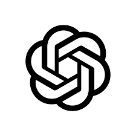

# Terraform Modules for Curated Services
This repository consist of terraform modules for services that have been curated by the CCoE team. 
When using these services, Azure Policies will evaluate, audit, flag or deny if those services are not compliant with the company regulations 
By utilizing the modules in this repository, you can be certain that your templates will comply with all security policies that are applied to your subscriptions.

Do you need another service?

Consult the Azure service catalog
1. Identify the service you need: https://azure.microsoft.com/en-us/products/
1. Get a Sandbox subscription and try out the service. Make sure it fulfill your requirements
1. Contact the CCoE team to initiate the curation process: service-curation@crgarcia12.com.ar

# How to contribute
If there is a problem in any of the modules you can create an issue in the repo 
You are also welcome to open pull-requests to add new parametres

# Current list of modules for curated services

## Containers

    
    
    
    
    

## Databases

    
    
    
    
    
    

## Integration

    
    

## Compute

    
    
    
    
    
    
    

## AI into your apps

    
    
    
    
    
    
    
    
    
    
    
    
    
    
    
    
    
    

      

# Services description
## Azure Kubernetes Service
 
>Azure Kubernetes Service (AKS) simplifies deploying a managed Kubernetes cluster in Azure by offloading the operational overhead to Azure. As a hosted Kubernetes service, Azure handles critical tasks, like health monitoring and maintenance. When you create an AKS cluster, a control plane is automatically created and configured. This control plane is provided at no cost as a managed Azure resource abstracted from the user. You only pay for and manage the nodes attached to the AKS cluster.

### Example Architecture: 

### More information
Official documentation: https://learn.microsoft.com/en-us/azure/aks/ 
Service Owner Contact: aksowners@crgarcia.com.ar 
Terraform module: https://github.com/crgarcia-org/azure-ccoe-terraform-modules/tree/main/azure-kubernetes-service

## Azure Sql Database
 
>Azure SQL Database is a fully managed platform as a service (PaaS) database engine that handles most of the database management functions such as upgrading, patching, backups, and monitoring without user involvement. Azure SQL Database is always running on the latest stable version of the SQL Server database engine and patched OS with 99.99% availability. PaaS capabilities built into Azure SQL Database enable you to focus on the domain-specific database administration and optimization activities that are critical for your business.

### Example Architecture: 

### More information
Official documentation: https://learn.microsoft.com/en-us/azure/azure-sql/database/sql-database-paas-overview?view=azuresql 
Service Owner Contact: dbowners@crgarcia.com.ar