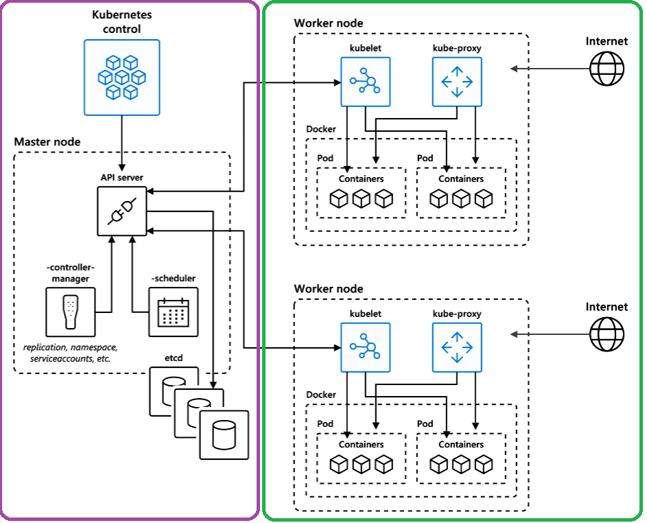

[](https://github.com/crgarcia12/azure-aks-advanced/actions/workflows/infra.yml)
[](https://github.com/crgarcia12/azure-aks-advanced/actions/workflows/app.yml)

<br/>

# Azure Kubernetes Service
>Azure Kubernetes Service (AKS) simplifies deploying a managed Kubernetes cluster in Azure by offloading the operational overhead to Azure. As a hosted Kubernetes service, Azure handles critical tasks, like health monitoring and maintenance. When you create an AKS cluster, a control plane is automatically created and configured. This control plane is provided at no cost as a managed Azure resource abstracted from the user. You only pay for and manage the nodes attached to the AKS cluster.

### Detailed Architecture:<br/>



### More information
Official documentation: https://learn.microsoft.com/en-us/azure/aks/</br>
Service Owner Contact: aksowners@crgarcia.com.ar

## How to use it?
This is a code snippet that you can add to your terraform templates:
```terraform
module "aks" {
  source              = "github.com/crgarcia-org/azure-ccoe-terraform-modules/aks/v1.0"
  prefix              = local.prefix
  location            = local.location
  resource_group_name = azurerm_resource_group.spoke_rg.name
  resource_group_id   = azurerm_resource_group.spoke_rg.id
}

```

## Module Variables
```terraform
Prefix
    This is the prefix that will be used to deploy all resources.
    We recommend using your department-environment. For example: trading-prod

Location
    This is the Azure region of the deployment. 
    Remember that if your application contains C1 data, your subscription is limited to Switzerland North 

resource_group_name
    The Azure Resource group that will be used to deploy kubernetes

network_plugin_mode
    For new clusters, we recommend Overlay.


```