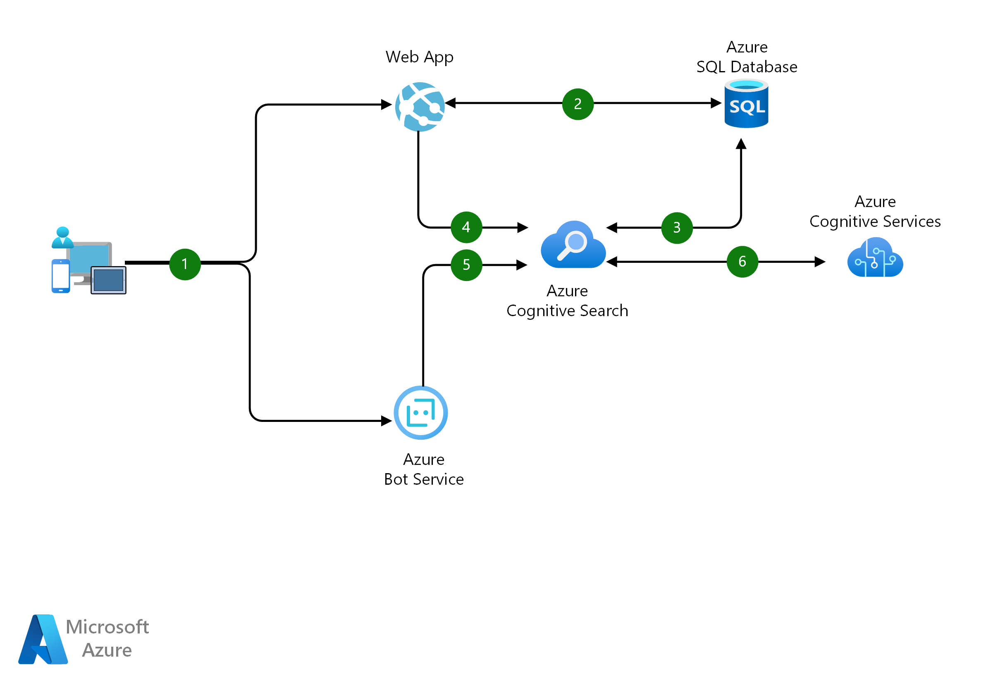

# Azure Cognitive Search module

## How to use this module

In your `main.tf` file, add the following:

```hcl
module "aks" {
  source              = "github.com/crgarcia-org/azure-ccoe-terraform-modules/cognitive-search/v2.0"
  prefix              = local.prefix
  location            = local.location
  resource_group_name = azurerm_resource_group.spoke_rg.name
}
```

# What is Azure Cognitive Search?


Azure Cognitive Search is an AI-powered platform as a service (PaaS) that helps developers build rich search experiences for applications. Create searchable databases for employees and integrate natural language processing search experiences into websites. ISVs can use the service to develop cutting-edge software as a service (SaaS) applications.

More details: [Microsoft official documentation]("https://learn.microsoft.com/en-GB/azure/search/")

# Sample architecture
This example scenario shows how using a dedicated search service can dramatically increase the relevance of search results for your e-commerce customers.


# Service Owner Contact
Main contact: Leo Messi Leo.Messi@ib.com<br>
Backup contact: ccoe@ib.com